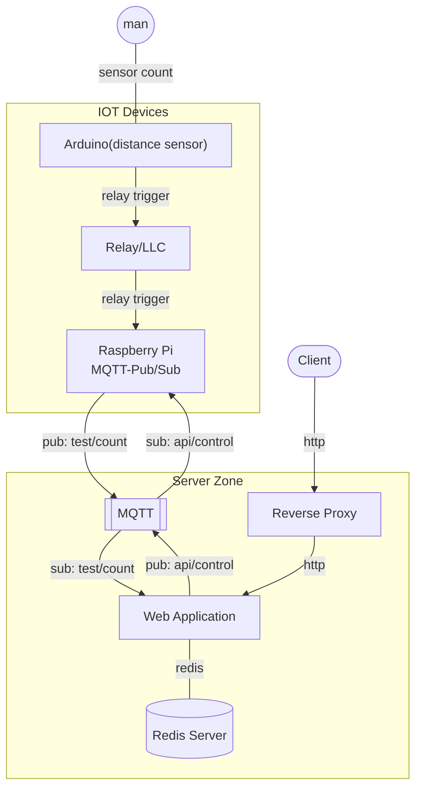

# python-mqtt-sse
## System Diagram

```mermaid
graph TD
    M((man)) ---|sensor count| AR
    AR["Arduino(distance sensor)"] -->|relay trigger| Relay["Relay/LLC"]
    Relay -->|"relay trigger"| RP
	RP[Raspberry Pi<br>MQTT-Pub/Sub] -->|pub: test/count|MQTT[[MQTT]]
    MQTT -->|sub: api/control|RP
    MQTT -->|sub: test/count|APP[Web Application]
    APP -->|pub: api/control|MQTT
    APP ---|redis| RD[(Redis Server)]
    RVPX[Reverse Proxy] -->|http| APP
    C([Client]) -->|http| RVPX

    subgraph IOT Devices
        AR
        Relay
        RP
    end

    subgraph Server Zone
        MQTT
        APP
        RVPX
        RD
    end
```
